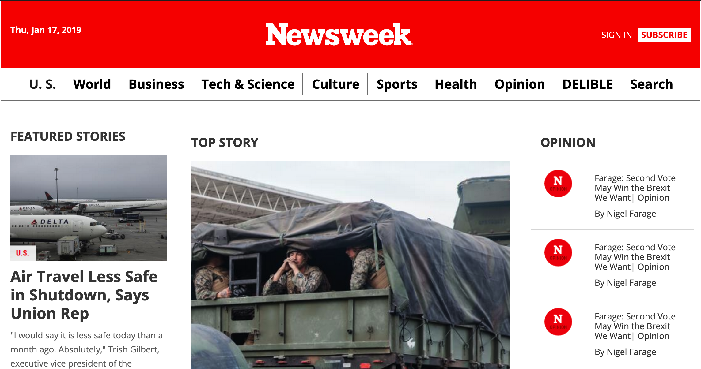

# Newsweek

Newsweek is a clone for Newsweek weekly news magazine.

## Technologies
HTML 5

CSS 3

## Framework
CSS Reset
Bootstrap

## Setup
> Open your git bash and **cd** to the location you'd like to put your files the run the command below.

`git@github.com:AdnanAfsari/newsweek.git`

Here is the link for live [preview](https://raw.githack.com/ljblunts/newsweek/development/index.html)

## Author
[Adnan Afsari](https://github.com/AdnanAfsari)
[JamesOkunlade](https://github.com/JamesOkunlade)

